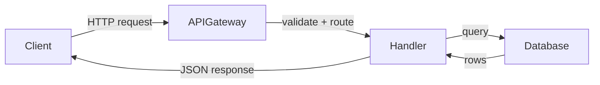

# Wiki generation

Read a repository, then produce a set of interconnected documentation pages that explain what the code does and how it fits together. The output is a `drool-wiki/` directory of markdown files, uploaded to Industry via `drool wiki-upload`.

## 0. Resolve base wiki

Before generating a new wiki from scratch, check whether a previous wiki already exists. If it does and the codebase hasn't changed much, only regenerate the pages affected by recent changes (INCREMENTAL MODE). If the codebase has changed significantly or no previous wiki exists, generate the entire wiki from scratch (FULL MODE).

### A. Locate an existing base wiki

Try these sources in order:

1. **Local wiki directory.** Check if `drool-wiki/` exists in the repository root with all three conditions met:

   - The directory contains at least one `.md` file
   - A `.wiki-meta.json` file exists inside it
   - The `.wiki-meta.json` contains a non-empty `commitHash` field

   If all three conditions are met, use `drool-wiki/` as the base wiki. Read `commitHash` from `.wiki-meta.json` — this is the commit the wiki was last generated from.

2. **Remote wiki history.** If no valid local wiki exists, fetch the remote wiki history:

   ```bash
   drool wiki-read --repo-url <url> --json
   ```

   This returns a list of previous wiki runs, each with `wikiRunId`, `createdAt`, `branch`, `commitHash`, and `pageCount`.

   Pick the run whose `commitHash` is closest to the current HEAD by running:

   ```bash
   git rev-list --count <wikiCommit>..HEAD
   ```

   for each candidate and choosing the one with the smallest distance.

   Materialize the chosen run into a temporary directory:

   ```bash
   WIKI_BASE_TMPDIR=$(mktemp -d)
   ```

   **Enumerate pages.** Fetch the full wiki run metadata (without `--page`) to get the page tree:

   ```bash
   drool wiki-read --wiki-run-id <id> --json
   ```

   The response includes a `pageTree` — a recursive structure where each node has `pageId`, `title`, `path`, `order`, and `children`. Collect every `pageId` from this tree.

   **Download each page.** For each `pageId`, fetch its content:

   ```bash
   drool wiki-read --wiki-run-id <id> --page <pageId> --json
   ```

   This returns `{ pageId, path, title, content }`. Write `content` to `$WIKI_BASE_TMPDIR/<path>`, creating subdirectories as needed (e.g., `mkdir -p` the parent of each path).

   **Reconstruct `.wiki-meta.json`.** The remote wiki has no `.wiki-meta.json` file — you must build it from the pageTree. Walk the tree in depth-first order, sorting children by their `order` field at each level, and collect every node's `path` into a `pageOrder` array. Write `.wiki-meta.json` to `$WIKI_BASE_TMPDIR` with `pageOrder`, plus the `commitHash` and `branch` from the wiki run metadata.

3. **No base wiki available.** If neither local nor remote wiki exists → proceed in **FULL MODE** (skip the rest of Step 0 and go directly to Step 1 with the standard full-generation flow).

### B. Compute delta

Once you have a base wiki and its `commitHash`, compute how much the codebase has changed since the wiki was generated:

```bash
git diff --shortstat <wikiCommit> HEAD -- . ':!*.lock' ':!package-lock.json' ':!*.generated.*'
```

This produces output like `42 files changed, 1500 insertions(+), 300 deletions(-)`. Sum the insertions and deletions to get the total changed lines.

**Mode selection based on total changed lines:**

| Total changed lines      | Mode             | Action                                                                            |
| ------------------------ | ---------------- | --------------------------------------------------------------------------------- |
| `git diff` command fails | FULL MODE        | Discard the base wiki and generate from scratch                                   |
| > 10,000 lines           | FULL MODE        | Discard the base wiki and generate from scratch                                   |
| 0 lines                  | SKIP             | Tell the user "Wiki is already up to date" and stop — do not proceed to Steps 1-5 |
| ≤ 10,000 lines           | INCREMENTAL MODE | Continue to Steps 1-3 using their incremental mode subsections                    |

### C. Corner case handling

| Condition                                                                  | Action                                                                 |
| -------------------------------------------------------------------------- | ---------------------------------------------------------------------- |
| `git diff` fails (bad commit hash, shallow clone)                          | Fall back to FULL MODE                                                 |
| Local `drool-wiki/` exists but has no `.wiki-meta.json` or no `commitHash` | Fall back to remote history for commit info; if unavailable, FULL MODE |
| Local `drool-wiki/` exists but has no `.md` files                          | Treat as no local wiki, try remote                                     |
| Remote wiki fetch fails (auth, network, feature flag)                      | Fall back to FULL MODE                                                 |
| Wiki was generated on a different branch                                   | Use `git merge-base` to find common ancestor, diff from there          |
| Delta is 0 (HEAD == wiki commit, no local changes)                         | Tell user wiki is current, skip generation                             |

## 1. Survey the repository

Before writing anything, build a mental model of the codebase. The survey has two passes: a structural scan and a deep code scan.

### Pass 1: Structural scan

Read these files (when they exist):

- `README.md`, `AGENTS.md`, `CONTRIBUTING.md` — project intent and conventions
- `package.json`, `Cargo.toml`, `go.mod`, `pyproject.toml` — dependencies and scripts
- `docs/` directory — existing documentation
- Entry points (`src/index.ts`, `main.go`, `app.py`, etc.) — how the application starts
- CI/CD config (`.github/workflows/`, `.gitlab-ci.yml`, `Jenkinsfile`, `azure-pipelines.yml`, etc.)
- Build tool config (`webpack.config.*`, `vite.config.*`, `Makefile`, `build/`, `Gulpfile.*`, etc.)
- Lint/quality config (`eslint.config.*`, custom lint plugins, `rustfmt.toml`, `.golangci.yml`, etc.)
- Directory listing of the project root and key subdirectories

Build a map of:

- **What the project does** — its purpose in one or two sentences
- **Major subsystems** — the main areas of the codebase (e.g., API layer, database models, CLI, frontend components)
- **Key data flows** — how data moves through the system (request → handler → database → response)
- **External dependencies** — databases, APIs, message queues, third-party services
- **Build and test commands** — how to build, test, and run the project

### Pass 2: Deep code scan

The structural scan catches what's visible from directory names and config files. The deep scan catches features, domains, and capabilities that are only visible in the code itself. Probe the codebase for signals that reveal topics the structural scan missed:

- Grep for feature flag names in constants files — each flag often represents a distinct capability worth documenting
- Scan frontend route definitions and page components — each route group is a user-facing feature
- Scan API endpoint groups — each controller or router file represents a domain area
- Look inside `src/features/`, `src/modules/`, `src/domains/`, or equivalent directories — the names and contents reveal product capabilities
- Scan for service classes, event handlers, and job/worker definitions — these reveal background systems
- Check for domain-specific directories that don't map to obvious top-level names

The goal is to discover the **complete list of topics** the wiki should cover. The structural scan gives you the skeleton; the deep scan fills in the muscle. A feature like "Analytics" might not have its own top-level directory but lives inside `src/features/analytics/` or is revealed by a set of feature flags and API endpoints.

### Exhaustive subsystem discovery

After both passes, walk every top-level source directory (and one level below) to check for subsystems you missed. For each directory that contains its own service, module, or feature, decide:

- **Tier 1** — core subsystems most contributors will encounter. Full dedicated page.
- **Tier 2** — important but specialized. Shorter dedicated page.
- **Tier 3** — niche or thin wrapper. A paragraph in an "Other subsystems" page with directory pointers.

Small repos may only need a few domain pages. Large repos should have as many as the codebase warrants. Do not cap arbitrarily — let the repo's actual structure determine coverage.

### Often-missed areas

After scanning the source tree, check for these commonly overlooked areas:

- **Custom lint/analysis rules** — plugins or config that enforce project-specific conventions
- **Automation workflows** — CI/CD, bots, scheduled jobs, code generation scripts
- **CLI or dev tools** — internal tools, scripts in `scripts/`, `tools/`, or `bin/`
- **Test infrastructure** — custom test frameworks, fixtures, or automation harnesses beyond standard test runners
- **Multi-language components** — if the repo has code in a second language (e.g., Rust CLI in a TypeScript project), document it

If any of these are non-trivial, they deserve coverage — either as their own page or as a section in a related page.

### Survey output

At the end of the survey, produce a **survey context document** — a compact summary that will be shared with sub-agents. This document should include:

- **Repo summary** — 3-5 sentences: what the project is, its tech stack, and high-level structure
- **Architecture overview** — major components and how they connect
- **Discovered topics** — the complete list of features, systems, apps, packages, and primitives found during both scan passes
- **Key patterns** — coding conventions, error handling patterns, testing patterns
- **Glossary seeds** — project-specific terms encountered during the scan
- **Directory-to-purpose map** — which source directories map to which topics

### Coverage cross-check

Before moving to planning, reconcile two independent topic sources to ensure nothing is missed:

**Source A: Discovered topics.** The topics found during Pass 1 (structural scan) and Pass 2 (deep code scan). These include cross-cutting features that don't map to a single directory (e.g., "LLM integration" spanning multiple packages, "authentication" touching frontend, backend, and CLI).

**Source B: Directory enumeration.** For each lens that applies to the repo, run `ls` on the corresponding source directories and list every subdirectory:

- For apps: list every directory under `apps/` (or the repo's equivalent)
- For packages: list every workspace package directory
- For features: list every subdirectory under the feature directory (e.g., `src/features/`, `packages/frontend/src/features/`, or wherever the repo organizes features)
- For systems: list the top-level source directories that contain service or module code

**Reconciliation:** Merge both lists. For every item on either list, decide:

1. **Wiki page** — the item becomes a planned page (or section within a page)
2. **Skip with reason** — the item is intentionally excluded, with a specific reason (e.g., "empty directory — 0 source files", "deprecated — only test fixtures remain", "thin wrapper — covered in parent package page", "internal tooling — 3 files, not worth a standalone page")

The discovered topics catch things that directories miss (cross-cutting concerns, emergent patterns). The directory enumeration catches things that discovery misses (features the agent didn't encounter in the files it read). Together they produce comprehensive coverage.

Silent omissions are not acceptable. If a source directory exists with non-trivial code and has no wiki topic, that's a gap that must be justified.

### Incremental mode

When in incremental mode (Step 0 selected INCREMENTAL MODE), skip the full structural scan and deep code scan of the entire repo. Instead:

1. Run `git diff --stat <wikiCommit> HEAD` to get the list of changed files and directories
2. Read existing base wiki pages to understand the current structure and coverage
3. Survey only the changed directories and files in the codebase — read their source code to understand what changed
4. `ls` all top-level source directories and compare against existing wiki page coverage to catch new subsystems the diff alone wouldn't surface
5. Check if any documented source paths no longer exist (deleted subsystems that need their wiki pages removed)

**Output:** A scoped survey context that includes the diff summary, list of affected wiki pages, new areas needing pages, and areas needing page removal. This replaces the full survey context document in incremental mode.

## 2. Plan the table of contents

Design a page tree before writing any prose. The wiki has three tiers of content: always-present pages, organizational lenses, and conditional sections.

### Always-present pages

These pages appear in every wiki, in this order:

1. `overview/` — introductory material grouped under one section
   - `index.md` — project overview: what it does, who uses it, quick links
   - `architecture.md` — system architecture with Mermaid diagrams
   - `getting-started.md` — prerequisites, install, build, test, run
   - `glossary.md` — project-specific terms and domain vocabulary
2. `by-the-numbers.md` — codebase statistics snapshot (see below)
3. `lore.md` — timeline and history of the codebase (see below)
4. `how-to-contribute/` — how to work in this codebase
   - `index.md` — work pickup, PR process, review expectations, definition of done
   - `development-workflow.md` — branch, code, test, PR, merge cycle
   - `testing.md` — frameworks, patterns, how to run, mock, and cover
   - `debugging.md` — logs, common errors, troubleshooting runbook
   - `patterns-and-conventions.md` — error handling, coding style, cross-cutting concerns
   - `tooling.md` — build system, linters, code generators, CI tooling (if the repo's tooling is the product itself, promote this to a top-level section instead)

### By the numbers

A top-level `by-the-numbers.md` page that gives a quantitative snapshot of the codebase. Start the page with a "Data collected on [date]" note so readers know how current the numbers are.

Include these sections:

- **Size** — lines of code by language (with a Mermaid horizontal bar chart), total source files vs test files vs config files, package/module count for monorepos
- **Activity** — commits per week/month (recent trend), most actively changed files/directories in the last 90 days (churn hotspots)
- **Bot-attributed commits** — percentage of commits with bot co-authorship (e.g., `Co-authored-by: industry-drool[bot]`, `dependabot[bot]`, `github-actions[bot]`, `copilot[bot]`). This is a lower bound on AI-assisted work since inline AI tools like Copilot leave no trace in git history. Be transparent about what's counted.
- **Complexity** — average file size by directory, deepest import chains, number of exported symbols per package

Use Mermaid `xychart-beta` (horizontal bar charts) for language breakdown and any other stat where a visual helps. Do NOT use Mermaid `pie` charts — they are not supported by the renderer. Use tables for lists of files/directories.

**Never include individual contributor stats** (top committers, lines per person, leaderboards). The by-the-numbers page is about the codebase, not the people. Per-person metrics create toxic comparisons and don't belong in team documentation. The `maintainers.md` page handles ownership mapping separately.

**Inline stats in other pages:** In addition to this summary page, weave relevant stats into existing pages:

- Language breakdown in `architecture.md`
- Churn hotspots in `cleanup-opportunities/` (if that section exists)
- File counts, bus factor (unique committers), and test-to-code ratio per subsystem on each domain page
- Dependency counts in `reference/dependencies.md`

### Lore

A top-level `lore.md` page that tells the story of how the codebase evolved. This is a narrative history, not a technical reference. It answers "what happened here and when?"

**Boundaries with other sections:**

- `by-the-numbers.md` = current snapshot (what the codebase looks like today)
- `lore.md` = timeline and history (what changed and when)
- `fun-facts.md` = light trivia (easter eggs, amusing discoveries)
- `background/` = technical rationale (why decisions were made)

**Every event, era, and milestone must include a date or month** (e.g., "Mar 2023", "Q4 2024"). Derive dates from git commit timestamps, tag dates, and file creation dates. If an exact date isn't available, use the month of the earliest relevant commit.

Include these sections:

- **Eras** — group the codebase history into 3-8 major phases, each with a short narrative description and key event bullet points. Derive from git history: tag dates, large merge commits, contributor patterns, directory creation dates. Example: "The TypeScript Migration (Mar–Aug 2023): The entire backend was rewritten from JavaScript to TypeScript over 5 months..."
- **Longest-standing features** — code or subsystems that have survived the most refactors and are still actively used. Include when they were first introduced and how many changes they've weathered.
- **Deprecated features** — things that were built, used, and then removed or replaced. Identify from directory names, README mentions, obvious `@deprecated` annotations, and removed routes. What was the feature, when was it introduced, when was it deprecated, and what replaced it.
- **Major rewrites** — large changes that touched many files. What existed before, what replaced it, and when. Derive from git history (large PRs, branch names with "migration" or "rewrite").
- **Growth trajectory** — how the codebase expanded over time: when packages/apps were added, contributor growth signals from git log.

**Speculation:** When the "why" behind a change isn't clear from commits, use natural hedging language ("appears to have been", "likely replaced due to"). No special formatting for speculative content.

### Organizational lenses

Five lenses are available for organizing the codebase deep-dives. Use any combination based on what the repo actually contains. At least one lens is required. Most repos use 2-3. The **features** lens is strongly encouraged -- it's the most intuitive entry point for new engineers ("what does this thing do?"). Even small repos typically have user-visible or developer-visible capabilities worth documenting. Only skip it if the repo is a single-purpose library with no distinct features.

| Concept                     | Default label   | Also called                                     | When to use                                                                 |
| --------------------------- | --------------- | ----------------------------------------------- | --------------------------------------------------------------------------- |
| Deployable units            | `applications/` | `services/`, `apps/`                            | Repo ships multiple distinct runtimes                                       |
| Internal building blocks    | `systems/`      | `services/`, `modules/`, `subsystems/`          | Architectural components that don't map to a single app or package          |
| Cross-cutting capabilities  | `features/`     | `capabilities/`, `workflows/`                   | User-visible or developer-visible things that span multiple systems         |
| Workspace packages          | `packages/`     | `libraries/`, `crates/`, `modules/`             | Monorepo with shared libraries worth documenting individually               |
| Foundational domain objects | `primitives/`   | `core-concepts/`, `domain-models/`, `entities/` | Types/concepts that appear across 3+ systems (e.g., session, user, message) |

**Choosing labels:** Mirror the repo's own vocabulary. If the repo has an `apps/` directory, call the section `apps/`, not `applications/`. If the repo calls things "services," use `services/`. The default labels are fallbacks for when the repo has no existing convention.

**Placement rules:**

- Place each concept where the repo's structure suggests it belongs. If agent logic lives in `packages/drool-core`, document it under packages, not systems.
- The systems lens is for things that don't have a natural home in apps or packages -- emergent architectural patterns, cross-package systems, infrastructure that spans multiple directories.
- Do not duplicate content across lenses. If something is documented under packages, the relevant app page should cross-link to it, not repeat it.

**Heuristics for identifying each lens:**

- If it has its own entry point and deployment, it's an **application**
- If it's a workspace package that other packages import, it's a **package**
- If it's a module with internal logic and clear boundaries that doesn't map to a single package, it's a **system**
- If it's a type or concept that appears in 3+ systems, it's a **primitive**
- If understanding it requires tracing through multiple systems or apps, it's a **feature**

### Conditional sections

Include these based on your judgment after surveying the repo. Skip any that don't apply.

- `api/` — if the repo exposes REST, GraphQL, WebSocket, or other APIs
- `deployment/` — if there's a non-trivial deployment process (CI/CD, environments, rollback, infrastructure)
- `security/` — if there are meaningful trust boundaries (auth, authorization, secrets, input validation)
- `background/` — if the repo has meaningful history (design decisions, pitfalls/danger zones, migration context)
- `how-to-monitor/` — if the repo runs as a service with logging, metrics, tracing, or alerting infrastructure
- `cleanup-opportunities/` — if the repo has dead code, accumulated TODOs/FIXMEs, oversized files, or outdated dependencies. Only include if there is actual content to report (see below)
- `fun-facts.md` — easter eggs, origin stories, oldest code, naming origins

### How to monitor

This conditional section documents how to see what the system is doing. Only generate it for repos that run as services with logging, metrics, or tracing infrastructure. Not applicable to libraries, CLI tools, or packages.

Sub-pages:

- `logging.md` — where logs go, how to query them, log levels and conventions, structured logging patterns, how to add new log statements
- `metrics.md` — what metrics are tracked, key SLIs/SLOs, available dashboards, how to add new metrics
- `tracing.md` — distributed tracing setup, how to trace a request end-to-end, span naming conventions, how to instrument new code paths
- `alerting.md` — what alerts exist, alert thresholds and rationale, escalation paths, known noisy alerts, how to add new alerts

Skip any sub-page the repo has no infrastructure for. If only one sub-page has content, collapse `how-to-monitor/` into a single `how-to-monitor.md` file instead of a directory.

### Cleanup opportunities

This conditional section surfaces actionable maintenance work. Only generate it if the scan finds meaningful content. Possible sub-pages:

- `dead-ends.md` — files, exports, or modules that nothing imports. The code equivalent of a ghost town.
- `todos-and-fixmes.md` — accumulated TODO, FIXME, and HACK comments with file locations. Include the oldest ones.
- `complexity-hotspots.md` — the largest source files, deepest nesting, or most complex functions. A gentle nudge toward refactoring.
- `dependency-freshness.md` — outdated or unmaintained dependencies. The oldest dependency still in use.

Skip any sub-page that has no findings. If only one sub-page has content, collapse `cleanup-opportunities/` into a single `cleanup-opportunities.md` file instead of a directory.

### Maintainers

Include a top-level `maintainers.md` page that maps subsystems to the people who know them. This page uses two data sources:

- **CODEOWNERS file** (if it exists) — official ownership assignments
- **Git blame / git log** — the 2-3 most recent or frequent committers per directory or subsystem

Present as a table:

```markdown
| Subsystem      | Official owners (CODEOWNERS) | Recent contributors (git history) | Last activity |
| -------------- | ---------------------------- | --------------------------------- | ------------- |
| Authentication | @alice                       | alice, bob                        | 2 weeks ago   |
| CLI            | @charlie, @dave              | charlie, eve                      | 3 days ago    |
```

If the repo has no CODEOWNERS file, omit that column and derive all data from git history. If the repo has very few contributors (e.g., a solo project), skip this page entirely.

### Per-page active contributors

Each domain page (apps, systems, features, packages, primitives) should include an "Active contributors" byline as the very first line after the page heading, before the Purpose section:

```markdown
# Authentication

Active contributors: alice, bob

## Purpose

...
```

Derive the names from CODEOWNERS (if available) merged with the top 2-3 recent committers from git blame for that subsystem's directory. Use first names or GitHub usernames, no @ symbols.

**Exclude bot accounts** from contributor lists — filter out usernames ending in `[bot]` (e.g., `industry-drool[bot]`, `dependabot[bot]`, `github-actions[bot]`). Bots are not people you'd reach out to with questions. This applies to both the per-page active contributors byline and the maintainers page.

**Use the default branch for contributor data.** When deriving contributors from git blame or git log, always query against the default branch (`main` or `dev`), not the current branch. Feature branches skew contributor data toward whoever is working on that branch. Use `git log origin/main -- <path>` or `git log origin/dev -- <path>` to get accurate contributor history.

### Bottom sections

These appear at the end of every wiki:

- `reference/` — configuration, data models, external dependencies
- `maintainers.md` — subsystem ownership table (conditional, skip for solo projects; always the very last page)

### Page ordering

The sidebar ordering is critical for navigation. Every page must appear in its defined position — do NOT group childless pages together at the top or bottom.

The full ordering in the wiki is:

1. overview/ (index, architecture, getting-started, glossary)
2. by-the-numbers.md (if present)
3. lore.md (if present)
4. fun-facts.md (if present)
5. how-to-contribute/
6. [organizational lenses, in whatever order makes sense]
7. [conditional sections: api, deployment, security, how-to-monitor, background, cleanup-opportunities]
8. reference/
9. maintainers.md (if applicable, always last)

**Ordering rules:**

- Each page stays in its defined position regardless of whether it has children. `by-the-numbers.md` appears after `overview/` even though it has no children, not at the top with other childless pages.
- The `pageOrder` array in `.wiki-meta.json` must exactly follow this ordering. It controls the sidebar display order.
- Within a lens section (e.g., `apps/`), order pages from most important to least important. The `index.md` is always first.
- Conditional sections appear in the order listed above (api → deployment → security → how-to-monitor → background → cleanup-opportunities), not alphabetically.

### Nesting rules

- Any page can expand into a directory with sub-pages, except the four pages inside `overview/` (`index.md`, `architecture.md`, `getting-started.md`, `glossary.md`) which are always single files
- Maximum depth: 2 levels from any lens root (e.g., `apps/cli.md` or `apps/cli/index.md` + `apps/cli/tui-rendering.md`). No deeper.
- Every directory must contain an `index.md`
- For large repos (50+ source directories or 10+ distinct subsystems), lean toward splitting pages rather than cramming. A 3000-word page covering an entire subsystem is less useful than three focused pages covering its distinct aspects. Critical sub-agents decide whether to create sub-pages based on what they find in the code.
- For small repos, default to single pages and only split when a topic has clearly distinct sub-areas
- Deployment and security start as single pages; expand to directories only if the repo has enough substance

### Naming rules

- Use lowercase filenames with hyphens: `getting-started.md`, not `GettingStarted.md`
- File names use lowercase with hyphens. No spaces, no uppercase.

### Page title rules

Page titles (the `# Heading` at the top of each `.md` file) should be concise noun phrases that match how the team refers to the thing. The section hierarchy already provides context, so titles should not repeat it.

- **Don't prepend directory paths.** Title is "CLI", not "apps/cli — CLI Architecture".
- **Don't append generic suffixes.** Title is "Apps", not "Apps Overview". Title is "Packages", not "Packages — Overview". The only exception is `overview/index.md` which may include the project name (e.g., "Industry platform overview").
- **Don't repeat the parent section name.** A page at `features/sessions.md` is titled "Sessions", not "Features — Sessions".
- **Match the team's vocabulary.** If the team calls it "the daemon", title is "Daemon", not "Background Service Process".
- **Keep it short.** Aim for 1-3 words. If a title needs more, the page probably covers too much and should be split.

### Incremental mode

When in incremental mode, start from the existing TOC (from the base wiki's `.wiki-meta.json` `pageOrder`) instead of designing the page tree from scratch. Only plan the changes:

- **Pages to update** — pages whose underlying source code changed (identified by the scoped survey)
- **Pages to create** — new subsystems or features that were added since the last wiki generation and need new pages
- **Pages to remove** — subsystems that were deleted and whose wiki pages should be removed
- **Pages to keep unchanged** — pages whose source code did not change; these will be copied verbatim from the base wiki

Special page rules:

- `by-the-numbers.md` should always be refreshed — it depends on git history and codebase stats which have changed since the last generation
- `lore.md` should only be refreshed if the delta is substantial enough to warrant new history entries. Use your judgment based on the nature of changes — a major rewrite or new subsystem warrants an update, minor bugfixes do not

## 3. Generate pages (with sub-agent delegation)

Page generation uses a top-level agent for orchestration and foundation pages, then delegates domain pages to sub-agents for depth and parallelism.

### Execution DAG

```
1. SURVEY (top-level)
   Structural scan + deep code scan
   Produce: survey_context
        │
        ▼
2. PLAN (top-level)
   Decide lens sections, list all pages, mark criticality
   Produce: page_plan (JSON with per-page briefs)
        │
        ▼
3. FOUNDATION PAGES (top-level, sequential)
   Write: overview/*, how-to-contribute/patterns-and-conventions
   These establish shared vocabulary and conventions
        │
        ├────────────────────────────────────────┐
        ▼                                        ▼
4a. LENS PAGES (sub-agents, parallel)     4b. DATA PAGES (sub-agents, parallel)
    Critical pages: 1 agent each               by-the-numbers
    Normal pages: batched 3-5                  lore
    Each agent writes its page(s)              fun-facts
    + sub-pages if warranted
        │                                        │
        ├────────────────────────────────────────┘
        ▼
5. REMAINING PAGES (sub-agents, parallel)
   how-to-contribute/ (remaining pages)
   Conditional sections: api, deployment, security,
     how-to-monitor, background, cleanup-opportunities
   reference/ + maintainers.md
        │
        ▼
6. ASSEMBLY (top-level)
   Cross-link audit, .wiki-meta.json
        │
        ▼
7. UPLOAD
```

### Step 2: Planning and delegation

After the survey, the top-level agent produces a **page plan** — a structured list of every page the wiki will contain. For each page, the plan includes:

- **Path** — the file path (e.g., `apps/cli/index.md`)
- **Title** — the page heading
- **Criticality** — `critical` (gets a dedicated sub-agent) or `normal` (batched with related pages)
- **Content brief** — 2-3 sentences describing what the page should cover and what code paths to read
- **Relevant source paths** — specific files/directories the sub-agent should read
- **Related pages** — titles, paths, and one-line summaries of other pages being written, so the agent knows what to link to instead of explaining

**Criticality guidelines:** Pages covering apps, packages, or features with large codebases, high churn, or central architectural roles are strong candidates for dedicated agents. Examples: a CLI with 50+ source files, a core library imported by most other packages, a feature that spans 5+ directories. The agent uses its judgment from the survey — these are guidelines, not hard rules.

**Depth guidelines for sub-agents:** A single page should not try to cover a complex subsystem end-to-end. Sub-agents should create sub-pages when:

- The subsystem has 3+ clearly distinct internal areas (e.g., a CLI has TUI rendering, exec mode, skills system, session management — each deserves its own page)
- A single page would exceed ~2000 words to cover the topic adequately
- The subsystem has multiple entry points or distinct user-facing modes

Examples of when to split:

- A CLI app with 50+ source files and 4000+ line entry points → sub-pages for each major subsystem (e.g., `cli/tui-rendering.md`, `cli/exec-mode.md`, `cli/skills.md`, `cli/session-management.md`)
- A backend with distinct API groups, auth system, and job runner → sub-pages for each
- A frontend package with 10+ feature modules → sub-pages for the most complex ones

Examples of when NOT to split:

- A utility package with 5 files and a single purpose → one page
- A simple microservice with one handler → one page
- A config or constants package → one page

### Step 3: Foundation pages

The top-level agent writes these pages sequentially before any sub-agents run:

1. `overview/index.md` — project overview
2. `overview/architecture.md` — system architecture with Mermaid diagrams
3. `overview/getting-started.md` — prerequisites, install, build, test, run
4. `overview/glossary.md` — project-specific terms
5. `how-to-contribute/patterns-and-conventions.md` — coding patterns and conventions

These pages establish the shared vocabulary and architectural context that sub-agents reference. They must be complete before delegation begins.

### Step 4: Sub-agent delegation (parallel)

Two groups of sub-agents run in parallel:

**4a. Lens pages** — all organizational lens pages (apps, systems, features, packages, primitives):

- **Critical pages** get a dedicated sub-agent each. The sub-agent reads the relevant code, writes the page, and autonomously decides whether sub-pages are warranted. If a topic has clearly distinct sub-areas, the agent creates sub-pages (capped at 2 levels: `section/page.md`). The top-level agent does NOT pre-plan sub-pages for critical pages — the sub-agent explores and decides.
- **Normal pages** are batched 3-5 per sub-agent, grouped by relatedness (e.g., 3 small packages together, or 2 related features). Batched pages are typically single files without sub-pages.

**4b. Data pages** — run in parallel with lens pages since they only need git history and source file structure:

- `by-the-numbers.md`
- `lore.md`
- `fun-facts.md`

### Step 5: Remaining pages (parallel)

After all lens pages complete, spawn sub-agents for:

- `how-to-contribute/` remaining pages (development-workflow, testing, debugging, tooling) as one batch
- Each conditional section as its own sub-agent or small batch: api, deployment, security, how-to-monitor, background, cleanup-opportunities
- `reference/` + `maintainers.md` as one batch

These pages can now cross-reference lens pages since they're complete.

### Step 6: Assembly

The top-level agent does a final pass:

- Audit cross-links between pages (fix broken references, add missing links)
- Verify that all inline code file references use full repo-root paths (not just filenames), so that rendered source code links point to valid URLs
- Write `.wiki-meta.json` with final page list and ordering
- Verify all directories have `index.md` files

### Sub-agent prompt template

Every sub-agent receives a prompt with this structure:

```
You are writing wiki page(s) for [repo].

## Shared Context
[The survey_context document from Step 1 — compact repo overview,
architecture, key patterns, glossary terms. Same for all agents.]

## Your Assignment
Pages: [list of pages this agent is responsible for]
Criticality: [critical or normal]
Content brief: [2-3 sentences per page describing what to cover]
Relevant source paths: [specific files/directories to read]

## Related Pages (link to these, don't duplicate their content)
- apps/cli (apps/cli/index.md): "CLI architecture, entry points, and TUI rendering"
- features/llm-integration (features/llm-integration.md): "LLM provider abstraction and streaming"
- ...

## Rules
- Follow the page template (sections 3a-3e in the skill)
- Maximum nesting: 2 levels (section/page.md)
- For critical pages: explore the code and create sub-pages if the topic
  has clearly distinct sub-areas. Write both the index.md and sub-pages.
- For normal pages: write single-file pages unless complexity demands splitting
- Use Mermaid diagrams when they help explain data flows or component relationships
- Cross-link to related pages listed above instead of re-explaining their topics
- Write output to [wiki_dir path]
```

The **shared context** is the same for all agents — the compact survey document. The **per-page brief** is tailored by the top-level agent during planning. This ensures no sub-agent re-discovers what the survey already found, and no sub-agent explains what another page covers.

For each page:

### 3a. Read the relevant code

Open and read the actual source files for the section you are writing. Do not guess or hallucinate file contents. If a file is too large, read the parts that matter for the current section.

### 3b. Write prose

Explain what the code does in plain language. Start with the high-level purpose, then drill into specifics. Every claim should be traceable to a specific file or function.

Each domain page should include these sections (skip any that don't apply to the subsystem):

0. **Active contributors** — a one-line byline immediately after the heading (see "Per-page active contributors" in Section 2)
1. **Purpose** — what this subsystem does, in 2-3 sentences
2. **Directory layout** — a file tree showing the key files and folders
3. **Key abstractions** — a table of the most important types (classes, interfaces, traits, structs, functions) with their file path and a one-line description
4. **How it works** — the main data/control flow, with a Mermaid diagram if it involves 3+ components
5. **Integration points** — how this subsystem connects to others (what it imports, what calls it, what events it emits/listens to)
6. **Entry points for modification** — 2-3 sentences telling a developer where to start if they need to change or extend this subsystem

Let the complexity of the subsystem determine how long the page is. A thin wrapper might only need sections 1, 3, and 5. A complex subsystem might need all six with multiple diagrams.

### 3c. Add Mermaid diagrams

Use Mermaid diagrams to illustrate:

- **Architecture** — system components and how they connect
- **Data flows** — request lifecycle, event pipelines, processing stages
- **State machines** — authentication flows, order states, build pipelines

Mermaid diagram guidelines:

- Use `graph TD` or `graph LR` for architecture and flow diagrams
- Use `sequenceDiagram` for request/response flows between services
- Use `stateDiagram-v2` for state machines
- Keep diagrams focused — 5 to 15 nodes maximum. Split larger diagrams into multiple smaller ones
- Label edges with the action or data being passed
- Use subgraphs to group related components

Example:

````markdown

````

Do not use Mermaid for simple relationships that a sentence can explain. A diagram should earn its place by showing something that is hard to describe in words.

### 3d. Add file references

Each domain page must include a **"Key source files"** table listing the most important files for that subsystem:

```markdown
| File                        | Purpose                                        |
| --------------------------- | ---------------------------------------------- |
| `src/auth/middleware.ts`    | Validates JWT tokens, attaches user to request |
| `src/auth/token-service.ts` | Token creation, refresh, and revocation        |
```

The table should cover whatever files are important — don't pad it with trivial files and don't skip files just because there are few.

Reference every file you mention in prose. When mentioning a class, interface, function, or type, include its file path in backticks on first mention. Always use the **full path from the repository root** (e.g., `apps/backend/src/auth/middleware.ts`, not just `middleware.ts`). These paths are rendered as clickable source code links, and short filenames without directory paths will produce broken links. Readers should be able to go from the documentation to the code in one step.

### 3e. Cross-link pages

Link between pages using relative markdown links:

```markdown
For details on how the auth middleware integrates with the API layer,
see [API authentication](../api/authentication.md).
```

Each page should link to at least one other page. The reader should be able to navigate the wiki without using the sidebar.

### 3f. Fun facts content

The `fun-facts.md` page is optional but encouraged. Pick the 3-5 most interesting topics for the specific repo from this list:

- **Oldest surviving code** — find the oldest file or function via git blame. How old is it? Has it changed much?
- **Dependency archaeology** — the oldest dependency still in use, or the one with the most major version bumps
- **Naming origins** — why is the project or its internal tools named what they are? Engineers name things weirdly and there's usually a story
- **TODO/FIXME count** — how many TODO/FIXME/HACK comments exist? What's the oldest one?
- **The longest file** — which source file has the most lines? A gentle call-out that doubles as a refactoring hint

Do not force all of these into every wiki. Pick only the ones where the repo has something genuinely interesting to say. If nothing stands out, skip fun-facts entirely.

### Incremental mode

When in incremental mode, use a copy-and-update strategy instead of generating all pages from scratch:

1. **Copy unchanged pages** from the base wiki location (local `drool-wiki/` or the temporary directory from Step 0) directly into the output `drool-wiki/` directory. Do not regenerate these pages.
2. **Delegate sub-agents only for pages that need updating or creating.** Sub-agents receive the same shared context plus the scoped survey context from Step 1 plus the existing page content they are updating (so they can preserve structure and only modify what changed).
3. **Remove pages** that the plan (Step 2) marked for removal — do not copy them from the base wiki into the output directory.
4. **Clean up the temporary directory** if the base wiki was fetched from remote (the temp dir created in Step 0). Delete it after all pages have been copied or regenerated.

## Phase 3.5: Visual Capture (QA-Driven Screenshots)

This phase runs after content generation and index finalization (Phase 3) and before the final summary (Phase 4). It captures screenshots from running applications and embeds them into wiki pages to provide visual context alongside textual documentation.

**This entire phase is optional.** If any prerequisite is missing, skip the phase with a warning and proceed to Phase 4. Collect all warnings into a list and include them in the Phase 4 summary.

### Step 3.5.1: Check Prerequisites

Before attempting any capture, verify ALL of the following. If any check fails, skip this entire phase with a warning message explaining what is missing.

**1. QA skill presence:**

```bash
test -f .industry/skills/qa/config.yaml && echo "QA config found" || echo "SKIP: No QA config"
```

If `.industry/skills/qa/config.yaml` does not exist, inform the user: `"Phase 3.5 requires a QA skill. Run /install-qa to set one up, then re-run the wiki generation."` and skip this entire phase (proceed to Phase 4).

**2. Tool availability:**

Check that the required capture tools are installed:

```bash
command -v agent-browser && echo "agent-browser available" || echo "WARN: agent-browser not found"
command -v tuistory && echo "tuistory available" || echo "WARN: tuistory not found"
```

- If `agent-browser` is not available, skip all web/desktop app captures. Add warning: `"Web/desktop screenshots skipped: agent-browser not installed"`.
- If `tuistory` is not available, skip all CLI/TUI captures. Add warning: `"TUI snapshots skipped: tuistory not installed"`.
- If BOTH tools are missing, skip the entire phase with warning: `"Phase 3.5 skipped: neither agent-browser nor tuistory is available"` and proceed to Phase 4.

**3. Discoverable apps:**

Read `.industry/skills/qa/config.yaml` and parse the `apps` section. Each app entry may include:

- `dev_command` — how to start the app's dev server
- `port` — the port the app listens on
- `test_tool` — `agent-browser` (for web/desktop) or `tuistory` (for CLI/TUI)
- `skill` — reference to the sub-skill with test flows (e.g., `qa-web`)

Filter to apps that have BOTH `dev_command` and a corresponding available tool (`agent-browser` for web apps, `tuistory` for CLI apps). If no apps pass this filter, skip the phase with warning: `"Phase 3.5 skipped: no apps with dev_command and available capture tool found"`.

### Step 3.5.2: Start Dev Servers

For each app that passed the prerequisite check:

1. **Check if the server is already running** by hitting its health endpoint or port:

   ```bash
   curl -sf http://localhost:<port>/ >/dev/null 2>&1 && echo "Already running" || echo "Need to start"
   ```

2. **If not running, start the dev server** using the app's `dev_command` from the QA config:

   ```bash
   # Run in background, capture PID for cleanup
   nohup <dev_command> > /tmp/wiki-capture-<app_name>.log 2>&1 &
   DEV_PID=$!
   echo "Started <app_name> dev server (PID: $DEV_PID)"
   ```

3. **Wait for readiness** by polling the port with retries:

   ```bash
   for i in $(seq 1 30); do
     curl -sf http://localhost:<port>/ >/dev/null 2>&1 && break
     sleep 2
   done
   ```

   If the server does not become ready within 60 seconds (30 retries × 2s), add warning: `"Screenshots for <app_name> skipped: dev server failed to start on port <port>"` and skip that app. Do not abort the entire phase — continue with other apps.

4. **Track all started PIDs** in a list for cleanup in Step 3.5.7.

### Step 3.5.3: Authenticate (Web/Desktop Apps)

For web/desktop apps that require authentication, use the QA config's persona definitions to log in:

1. Look up the personas section in `.industry/skills/qa/config.yaml`. Find a persona suitable for screenshot capture (typically one with pre-existing data). Note its `email`, `auth_method`, `credentials_source`, and `secret_name` fields.

2. **Retrieve credentials:**

   Read the `credentials_source` field from the persona config to determine how to obtain the password. Common patterns:

   - `env_var`: read from the environment variable named in `secret_name`
   - `secrets_manager`: retrieve from the configured secrets backend

   ```bash
   # Example: credentials sourced from an environment variable
   QA_PASSWORD="${!SECRET_NAME:-}"
   ```

   If the credentials are not available, add warning: `"Screenshots for <app_name> skipped: QA credentials not available (<secret_name> not set)"` and skip authenticated captures for that app. Unauthenticated pages (login screen, public pages) can still be captured.

3. **Perform login via agent-browser:**

   ```bash
   agent-browser --session "wiki-capture" open "http://localhost:<port>"
   # Wait for login page to load
   # Enter email from the chosen persona
   # Enter password
   # Submit and wait for authenticated state
   ```

   Follow the `auth_method` specified in the persona config (e.g., password login, OTP, SSO redirect) to complete authentication.

4. If authentication fails after 2 attempts, add warning: `"Authenticated screenshots for <app_name> skipped: login failed"` and continue with unauthenticated captures only.

### Step 3.5.4: Capture Screenshots

#### For Web/Desktop Apps (agent-browser)

1. **Discover navigation flows** by reading the app's QA sub-skill at `.industry/skills/qa-<skill_name>/SKILL.md`. Parse the "Available Test Flows" section to extract routes and pages that the app exposes (e.g., `/sessions`, `/settings`, `/wiki`, `/analytics`).

2. **Navigate each route and capture:**

   For each route discovered from the QA sub-skill flows:

   ```bash
   # Navigate to the route
   agent-browser --session "wiki-capture" eval "window.location.href = 'http://localhost:<port><route>'"

   # Wait for page to stabilize (no loading spinners, content rendered)
   sleep 3

   # Capture screenshot
   agent-browser --session "wiki-capture" screenshot "drool-wiki/images/<app_name>-<route_slug>.png"
   ```

   Generate `<route_slug>` by converting the route path to a filename-safe string (e.g., `/settings/billing` → `settings-billing`).

3. **Apply heuristic filters** — Skip or discard captures that match these patterns:

   - **Auth/login pages:** Page contains a login form, "Sign in", "Log in", or third-party auth provider branding. These are not useful for documentation.
   - **Error pages:** Page shows error boundaries, 404/500 messages, or "Something went wrong".
   - **Loading states:** Page shows only skeleton loaders, spinners, or "Loading..." text without meaningful content.
   - **Empty states:** Page shows only "No data" or "Get started" with no informational content.

   To apply these heuristics, take a snapshot of the page's accessibility tree after each screenshot:

   ```bash
   agent-browser --session "wiki-capture" snapshot
   ```

   Check the snapshot text for the disqualifying patterns above. If a page matches, discard the screenshot file and note it was filtered.

#### For CLI/TUI Apps (tuistory)

1. **Start the CLI tool** using the `dev_command` from the QA config within a tuistory session:

   ```bash
   tuistory -s wiki-tui-capture run "<dev_command>"
   ```

2. **Capture text snapshots** at key interaction points:

   ```bash
   tuistory -s wiki-tui-capture snapshot --trim > "drool-wiki/images/<app_name>-<state_name>.txt"
   ```

3. **Apply the same heuristic filters** as for web apps — discard snapshots that show only loading states, error messages, or auth prompts.

4. **Clean up the tuistory session:**

   ```bash
   tuistory -s wiki-tui-capture stop
   ```

### Step 3.5.5: Match Screenshots to Wiki Pages

Use LLM judgment to determine which wiki pages each screenshot is relevant to.

1. **Build a mapping context** by reading each wiki page's title and first paragraph from the generated markdown files in `drool-wiki/`.

2. **For each captured screenshot/snapshot**, ask the LLM:

   > Given this screenshot from the `<app_name>` application showing `<route or state>`, which of the following wiki pages would benefit from including this image? Consider topical relevance — the screenshot should illustrate concepts discussed on the page.
   >
   > Available wiki pages:
   >
   > - `<page_path>`: <title> — <first paragraph summary>
   > - ...
   >
   > Return a JSON array of matching page paths, or an empty array if no page is a good match.

3. **Accept matches with confidence.** If the LLM returns no matches for a screenshot, the image is still stored in `drool-wiki/images/` but not embedded in any page. This is fine — it remains available for manual curation.

4. **Limit to at most 3 pages per screenshot** to avoid over-embedding the same image everywhere.

5. **Limit to at most 5 screenshots per page.** If a page already has 5 matched screenshots, skip additional matches for that page. Prefer the screenshots that are most topically relevant (matched with highest confidence). This prevents any single page from being flooded with images.

### Step 3.5.6: Embed Images in Wiki Pages

For each screenshot that matched one or more wiki pages:

#### Web/Desktop Screenshots (PNG images)

Insert a markdown image reference at a contextually appropriate location in the wiki page. Prefer placing images:

- After the introductory paragraph of a relevant section
- Before a "Related Pages" section
- Never at the very top of the page (before the title)

Format:

```markdown

```

Example:

```markdown

```

#### TUI Snapshots (text files)

Embed TUI snapshots as fenced code blocks rather than images:

```markdown
**CLI — <State description>:**

\`\`\`
<contents of the text snapshot file>
\`\`\`
```

Example:

```markdown
**CLI — Session list view:**

\`\`\`
┌─────────────────────────────────────┐
│ Industry Drool v1.2.3 │
│ Sessions: │
│ > My first session 2h ago │
│ Debug API issue 1d ago │
└─────────────────────────────────────┘
\`\`\`
```

### Step 3.5.7: Update metadata.json with Images Manifest

Extend the existing `drool-wiki/metadata.json` to include an `images` array that tracks all captured visual assets.

Add the following field at the top level of `metadata.json`:

```json
{
  "generated_at": "...",
  "git_commit": "...",
  "git_branch": "...",
  "project_name": "...",
  "project_type": "...",
  "files": [ ... ],
  "images": [
    {
      "path": "images/web-sessions.png",
      "source_app": "web",
      "source_flow": "sessions-page",
      "captured_at": "<ISO 8601 timestamp>",
      "wiki_pages": ["overview.md", "frontend-architecture/sessions.md"],
      "size_bytes": 145230
    },
    {
      "path": "images/cli-session-list.txt",
      "source_app": "cli",
      "source_flow": "session-list-view",
      "captured_at": "<ISO 8601 timestamp>",
      "wiki_pages": ["cli/overview.md"],
      "size_bytes": 1024
    }
  ]
}
```

For each image/snapshot:

- `path`: Relative path from `drool-wiki/` root to the image file
- `source_app`: The app name from QA config (e.g., `web`, `cli`, `backend`)
- `source_flow`: A slug describing the flow or route that produced the capture
- `captured_at`: ISO 8601 timestamp of when the capture occurred
- `wiki_pages`: Array of wiki page paths where this image is embedded (empty array if unmatched)
- `size_bytes`: File size in bytes (obtain via `wc -c < <file>` or `stat`)

### Step 3.5.8: Clean Up Capture Resources

1. **Close all agent-browser sessions:**

   ```bash
   agent-browser --session "wiki-capture" close
   ```

2. **Stop all dev servers that were started in Step 3.5.2:**

   ```bash
   # Kill each PID tracked during startup
   kill $DEV_PID_1 $DEV_PID_2 ... 2>/dev/null
   ```

   Only kill servers that this phase started. Do not kill pre-existing servers.

3. **Stop any tuistory sessions:**

   ```bash
   tuistory -s wiki-tui-capture stop
   ```

### Step 3.5.9: Compile Warnings Summary

Gather all warnings collected during this phase into a single list. These will be included in the Phase 4 summary. Example warnings:

- `"Phase 3.5: Captured 12 screenshots across 2 apps (web, cli). 3 screenshots filtered (2 auth pages, 1 loading state). 9 images embedded across 15 wiki pages."`
- `"Phase 3.5 warning: TUI snapshots skipped — tuistory not installed"`
- `"Phase 3.5 warning: Screenshots for backend skipped — no port configured"`

Pass these warnings forward to Phase 3.6 and Phase 4.

## Phase 3.6: Video Overview

This phase runs after visual capture (Phase 3.5) and before the meta file (Phase 4) and upload (Phase 5). It delegates video planning, rendering, validation, and metadata creation to the built-in `wiki-video-gen` skill.

Invoke the `wiki-video-gen` skill with the repository root, `repoUrl`, `wikiDir`, interactive/non-interactive mode, and the original user prompt text. `wiki-video-gen` is authoritative for:

- incremental prior-video detection and `minor`/`major` diff classification;
- `skip video` and `regenerate the video` prompt overrides;
- HyperFrames setup, doctor checks, composition, rendering, retry, muxing, captions, and poster generation;
- Industry brand treatment and narration pacing;
- MP4 validation and `videoOverview` metadata creation.

### Phase 3.6 output contract

`wiki-video-gen` must return one of three outcomes:

1. **Generated video** — `<wikiDir>/video/overview.mp4` exists and `<repo>/.industry/video/wiki/<slug>/videoOverview.json` contains `status: "ready"`, `sizeBytes`, `contentType: "video/mp4"`, `generatedAt`, `durationSeconds`, and any warnings.
2. **Reused video** — no local MP4 is required. The result identifies `copyFromWikiRunId`; Phase 5 must pass `--copy-from-wiki-run-id <priorWikiRunId>` to `drool wiki-upload`.
3. **Skipped/failed video** — no local MP4 is required. The result contains `videoOverview.status` of `"skipped"` or `"failed"` and warnings explaining why. Wiki generation remains non-fatal and continues to Phase 4.

The canonical upload artifact is `<wikiDir>/video/overview.mp4`. Optional local sidecars such as `overview.vtt`, `overview.srt`, and `overview-poster.png` may exist, but `wiki-upload` only relies on the MP4 and metadata handoff unless upload support is extended.

### Phase 3.6 metadata handoff

Merge the returned `videoOverview` metadata into `.wiki-meta.json` in Phase 4. If `wiki-video-gen` performed incremental classification, preserve its warning string containing the literal classification word (`minor` or `major`).

If `wiki-video-gen` reports reuse, do not generate or upload a new video file. Carry `copyFromWikiRunId` forward to Phase 5.

## 4. Write the meta file

After generating all pages, create `.wiki-meta.json` in the wiki directory root. The `pageOrder` array is critical -- it controls the display order of pages in the wiki sidebar. List every generated file path in the exact order you want them to appear. Without this, pages sort alphabetically.

Derive the `commitHash` and `branch` fields by running:

```bash
git rev-parse HEAD          # → commitHash
git rev-parse --abbrev-ref HEAD  # → branch
```

```json
{
  "generatedAt": "2025-01-15T10:30:00Z",
  "commitHash": "abc123def456",
  "branch": "main",
  "pageCount": 42,
  "topLevelSections": [
    "overview",
    "by-the-numbers",
    "lore",
    "fun-facts",
    "how-to-contribute",
    "apps",
    "systems",
    "features",
    "packages",
    "primitives",
    "api",
    "deployment",
    "security",
    "how-to-monitor",
    "background",
    "cleanup-opportunities",
    "reference",
    "maintainers"
  ],
  "pageOrder": [
    "overview/index.md",
    "overview/architecture.md",
    "overview/getting-started.md",
    "overview/glossary.md",
    "by-the-numbers.md",
    "lore.md",
    "fun-facts.md",
    "how-to-contribute/index.md",
    "how-to-contribute/development-workflow.md",
    "how-to-contribute/testing.md",
    "how-to-contribute/debugging.md",
    "how-to-contribute/patterns-and-conventions.md",
    "how-to-contribute/tooling.md",
    "apps/index.md",
    "apps/cli/index.md",
    "apps/cli/command-structure.md",
    "apps/cli/tui-rendering.md",
    "apps/daemon.md",
    "systems/index.md",
    "systems/auth.md",
    "features/index.md",
    "features/wiki-generation.md",
    "packages/index.md",
    "packages/common.md",
    "primitives/index.md",
    "primitives/session.md",
    "api/index.md",
    "api/rest-endpoints.md",
    "deployment.md",
    "security.md",
    "how-to-monitor/index.md",
    "how-to-monitor/logging.md",
    "how-to-monitor/metrics.md",
    "how-to-monitor/tracing.md",
    "how-to-monitor/alerting.md",
    "background/index.md",
    "background/design-decisions.md",
    "background/pitfalls.md",
    "background/migration-context.md",
    "cleanup-opportunities/index.md",
    "cleanup-opportunities/dead-ends.md",
    "cleanup-opportunities/todos-and-fixmes.md",
    "cleanup-opportunities/complexity-hotspots.md",
    "cleanup-opportunities/dependency-freshness.md",
    "reference/index.md",
    "reference/configuration.md",
    "reference/data-models.md",
    "reference/dependencies.md",
    "maintainers.md"
  ]
}
```

The example above is abbreviated. In practice, list every `.md` file in the wiki directory. The order must match the page ordering defined in Section 2: overview → by-the-numbers → lore → fun-facts → how-to-contribute → lenses → conditional → reference → maintainers.

## 5. Upload

### Pre-upload cloud sync check

Before uploading, run `drool wiki-upload --check` to verify wiki cloud sync is enabled. If the output is `disabled`, inform the user that their organization has disabled wiki cloud sync via enterprise controls, and that the wiki has been generated locally in drool-wiki/ but cannot be uploaded to Industry. Do not prompt about uploading or retry.

```bash
drool wiki-upload --check
# Prints "enabled" (exit 0) or "disabled" (exit 1)
```

### Standard upload (local wiki directory)

When the user wants to keep a local copy (the default):

```bash
drool wiki-upload \
  --repo-url "$REPO_URL" \
  --wiki-dir ./drool-wiki
```

Arguments:

- `--repo-url` — the repository URL (the remote origin, e.g., `https://github.com/org/repo`)
- `--wiki-dir` — path to the directory containing the generated markdown files
- `--cleanup` — (optional) delete the wiki directory after a successful upload
- `--copy-from-wiki-run-id <id>` — (optional) reuse the video overview from a prior wiki run. When set, the CLI does not upload a new video file; instead it sends `copyFromWikiRunId` to the backend, which re-references the prior run's S3 object. Use this when Phase 3.6 classified changes as `minor` and decided to reuse the prior video.

### Upload with video reuse (incremental minor path)

When Phase 3.6 classified the diff as `minor` and chose to reuse the prior video:

```bash
drool wiki-upload \
  --repo-url "$REPO_URL" \
  --wiki-dir ./drool-wiki \
  --copy-from-wiki-run-id "<priorWikiRunId>"
```

This skips the video file upload entirely. The backend copies the video reference from the prior run to the new run. The resulting wiki run has `videoOverview.status === "ready"` with a playable `s3Key` matching the prior run's size.

### Remote-only upload (--no-local handling)

When the user asks to generate the wiki without leaving files on disk (e.g., the user says "don't leave files locally" or passes a `--no-local` flag):

```bash
# Create a temporary directory
WIKI_TMPDIR=$(mktemp -d)

# Write all wiki files to the temporary directory instead of ./drool-wiki
# ... generate pages into $WIKI_TMPDIR ...

# Upload with --cleanup to remove the temp directory after success
drool wiki-upload \
  --repo-url "$REPO_URL" \
  --wiki-dir "$WIKI_TMPDIR" \
  --cleanup
```

The `--cleanup` flag tells the CLI to delete the `--wiki-dir` directory after a successful upload. If the upload fails, the directory is preserved so the user can retry.

### Post-upload message

After a successful upload, `drool wiki-upload` prints a "View your wiki" line containing the full dashboard URL. Present this link to the user in your final assistant message so they can open the wiki directly in the Industry web or desktop app.

If Phase 3.5 (Visual Capture) ran, also include the image capture results summary in the final message — number of screenshots captured, filtered, and embedded across wiki pages, plus any warnings collected during that phase.

### Upload targets

**In non-interactive/exec mode** (when you cannot prompt the user), use the following defaults:

- If the repository is hosted on GitHub: `--upload-to industry,github`
- Otherwise: `--upload-to industry`

**In interactive mode**, ask the user two separate questions to determine where to upload:

1. **"Would you like to upload the wiki to Industry cloud?"** — If yes, include `industry` in the targets. This makes the wiki viewable in the Industry web app.
2. **"Would you like to sync the wiki to the GitHub wiki tab?"** — If yes, include `github` in the targets. This makes the wiki browsable at `https://github.com/{owner}/{repo}/wiki`. Only ask this if the repository is hosted on GitHub.

Build the `--upload-to` flag from the answers (or defaults):

```bash
# Industry cloud only
drool wiki-upload --repo-url "$REPO_URL" --wiki-dir ./drool-wiki --upload-to industry

# GitHub wiki only
drool wiki-upload --repo-url "$REPO_URL" --wiki-dir ./drool-wiki --upload-to github

# Both
drool wiki-upload --repo-url "$REPO_URL" --wiki-dir ./drool-wiki --upload-to industry,github
```

If the user declines both (interactive mode only), skip the upload and inform them the wiki was generated locally in `drool-wiki/`.

**Prerequisites for GitHub sync:**

- The repository must be hosted on GitHub
- The GitHub wiki must already be initialized (at least one page created via the GitHub wiki tab UI). If not initialized, the command prints a helpful error directing the user to create the first page manually.
- Wiki cloud sync must be enabled for the organization

The GitHub sync flattens the wiki's hierarchical structure into GitHub's flat wiki format (using `--` as a path separator), rewrites internal links, generates a `_Sidebar.md` for navigation, and pushes to `{repo}.wiki.git`.

## Content principles

### Progressive disclosure

Start every page with a 1–3 sentence summary of what the page covers. Follow with an overview section that explains the main concepts. Put implementation details, edge cases, and configuration options later in the page.

A reader skimming the first paragraph of each page should get a useful overview of the entire system.

### Page size limit

Keep individual pages under 500KB. If a page approaches this limit, split it into sub-pages. For example, a large API reference page could become a directory with one page per endpoint group.

### Human writing rules

Write documentation that reads like a person wrote it. Technical docs are especially prone to AI-sounding patterns because the subject matter is dry. Fight that tendency.

**Specific rules to follow:**

1. **Cut inflated significance.** Do not write "serves as a testament to," "pivotal role in the evolving landscape," "setting the stage for," or "underscores the importance of." Just state what the thing does.

   Bad: "The authentication module serves as a critical pillar in the application's security landscape."
   Good: "The authentication module validates JWT tokens and attaches user context to requests."

2. **Cut promotional language.** Do not write "boasts," "vibrant," "rich," "profound," "showcasing," "exemplifies," "commitment to," "groundbreaking," "renowned," or "breathtaking." Technical docs describe; they do not sell.

   Bad: "The codebase boasts a rich set of vibrant utilities that showcase the team's commitment to developer experience."
   Good: "The `utils/` directory has helpers for string formatting, date parsing, and retry logic."

3. **Kill superficial -ing analyses.** Do not tack "highlighting," "ensuring," "reflecting," "symbolizing," "showcasing," or "contributing to" onto sentences to add fake depth.

   Bad: "The service processes events asynchronously, ensuring scalability while highlighting the system's robust architecture."
   Good: "The service processes events asynchronously. It pulls from an SQS queue and can handle ~500 events/second per instance."

4. **Avoid AI vocabulary words.** These words appear far more often in AI-generated text: additionally, crucial, delve, emphasizing, enduring, enhance, fostering, garner, interplay, intricate/intricacies, landscape (abstract), pivotal, showcase, tapestry (abstract), testament, underscore (verb), vibrant. Replace them with plainer alternatives.

5. **Skip the rule of three.** Do not force ideas into groups of three to sound comprehensive (e.g., "innovation, inspiration, and industry insights"). If there are two things, list two. If there are four, list four.

6. **Do not use copula avoidance.** Write "X is Y" or "X has Y" instead of "X serves as Y," "X stands as Y," "X represents Y," "X boasts Y," "X features Y," or "X offers Y."

   Bad: "The config module serves as the central hub for environment variable management."
   Good: "The config module reads environment variables and exports typed constants."

7. **Do not use negative parallelisms.** Avoid "It's not just X, it's Y" and "Not only X but Y" constructions.

8. **Use sentence case in headings.** Write "Getting started with authentication," not "Getting Started With Authentication."

9. **Cut filler phrases.** Replace "in order to" with "to," "due to the fact that" with "because," "it is important to note that" with nothing (just state the fact).

10. **Be specific, not vague.** Replace "industry experts believe" with a concrete reference. Replace "several components" with the actual component names. Replace "various configurations" with the actual config options.

11. **Avoid em dash overuse.** Use commas or periods instead of em dashes (—) in most cases. One em dash per page is fine; three or more is a pattern.

12. **Do not use chatbot artifacts.** Never write "I hope this helps," "Let me know if," "Here is an overview of," "Certainly!", or "Great question!" These are conversation patterns, not documentation.

### Concrete file references

Every factual claim about the code should point to the source file. Do not say "the system handles authentication" without saying where. Do not say "the database schema includes a users table" without pointing to the migration or model file.

When mentioning source files in inline code (backticks), always use the **full path from the repository root**. These backtick-wrapped file paths are automatically rendered as clickable links to the source code on GitHub/GitLab. Using just the filename will produce a broken link.

- Good: `apps/backend/src/app/api/v0/wiki/route.ts`
- Good: `.github/workflows/release-cut.yml`
- Bad: `route.ts` (ambiguous, link will 404)
- Bad: `release-cut.yml` (missing directory path, link will 404)

If you cannot find the file that implements something, say so: "The retry logic is referenced in `config.ts` but the implementation was not found in the current codebase."

### Mermaid diagram usage

Include at least one Mermaid diagram in the architecture page. Include diagrams in domain pages when they help explain data flows or component relationships. Do not add diagrams to every page — a page about configuration options or environment variables probably does not need one.

## File structure specification

The generated wiki follows this layout:

```
drool-wiki/
├── .wiki-meta.json

# Always present (in this order)
├── overview/                             # Introductory material
│   ├── index.md                          # Project overview
│   ├── architecture.md                   # System architecture with Mermaid diagrams
│   ├── getting-started.md                # Prerequisites, install, build, test, run
│   └── glossary.md                       # Project-specific terms and vocabulary
├── by-the-numbers.md                     # Codebase statistics snapshot
├── lore.md                      # Timeline, eras, deprecated features, rewrites
├── fun-facts.md                          # Easter eggs, origin stories, oldest code
├── how-to-contribute/                    # How to work in this codebase
│   ├── index.md
│   ├── development-workflow.md
│   ├── testing.md
│   ├── debugging.md
│   ├── patterns-and-conventions.md
│   └── tooling.md

# Organizational lenses (use any combination, at least one required)
# Labels mirror the repo's own vocabulary
├── <apps|services|applications>/         # Deployable units
│   ├── index.md
│   ├── <simple-app>.md                   # Single page for simple apps
│   └── <complex-app>/                    # Directory for complex apps
│       ├── index.md
│       └── <sub-topic>.md
├── <systems|modules|subsystems>/         # Internal building blocks
│   ├── index.md
│   ├── <simple-system>.md
│   └── <complex-system>/                 # 3rd level for complex subsystems
│       ├── index.md
│       └── <sub-topic>.md
├── <features|capabilities|workflows>/    # Cross-cutting capabilities
│   ├── index.md
│   ├── <simple-feature>.md
│   └── <complex-feature>/                # Features that span many systems deserve sub-pages
│       ├── index.md
│       └── <sub-topic>.md
├── <packages|libraries|crates>/          # Workspace packages
│   ├── index.md
│   ├── <simple-package>.md
│   └── <complex-package>/
│       ├── index.md
│       └── <sub-topic>.md
├── <primitives|core-concepts|entities>/  # Foundational domain objects
│   ├── index.md
│   └── *.md

# Conditional sections (LLM judgment)
├── api/                                  # If the repo exposes APIs
│   ├── index.md
│   └── *.md
├── deployment.md                         # Single page or directory
├── security.md                           # Single page or directory
├── how-to-monitor/                        # Logging, metrics, tracing, alerting (services only)
│   ├── index.md
│   ├── logging.md                        # Where logs go, how to query, log levels
│   ├── metrics.md                        # What's tracked, dashboards, SLIs
│   ├── tracing.md                        # Distributed tracing, request tracing
│   └── alerting.md                       # Alerts, thresholds, escalation, noisy alerts
├── background/                           # Design decisions, pitfalls, migration context
│   ├── index.md
│   └── *.md
├── cleanup-opportunities/                # Dead code, TODOs, complexity hotspots, stale deps
│   ├── index.md
│   ├── dead-ends.md                      # Unused files, exports, modules
│   ├── todos-and-fixmes.md               # Accumulated TODO/FIXME/HACK comments
│   ├── complexity-hotspots.md            # Largest files, deepest nesting
│   └── dependency-freshness.md           # Outdated or unmaintained dependencies

# Always present (bottom)
├── reference/
│   ├── index.md
│   ├── configuration.md
│   ├── data-models.md
│   └── dependencies.md
└── maintainers.md                        # Subsystem ownership table (conditional, always last)
```

**Rules:**

- Every `.md` file must start with a level-1 heading (`# Title`). The upload tool extracts the title from this heading.
- Every directory must contain an `index.md`.
- File names use lowercase with hyphens. No spaces, no uppercase.
- The `.wiki-meta.json` file is for tracking purposes and is not uploaded as a page.
- The four pages inside `overview/` (`index.md`, `architecture.md`, `getting-started.md`, `glossary.md`) are always single files. All other pages can expand into directories with sub-pages.
- Maximum tree depth: 2 levels from any lens root (e.g., `apps/cli/command-structure.md`). No deeper.
- For large repos, critical sub-agents decide whether to split into sub-pages. A complex subsystem like an editor core or extension host should have its own directory with focused sub-pages, not a single monolithic page.
- Maximum 200 pages per wiki run. If a project needs more, prioritize the most important subsystems.
